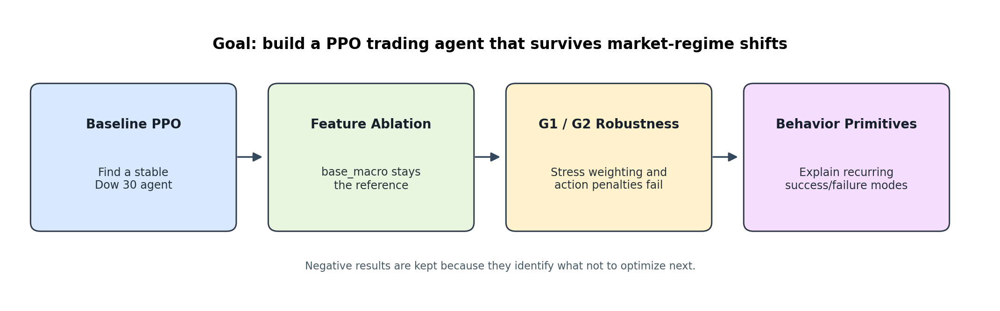
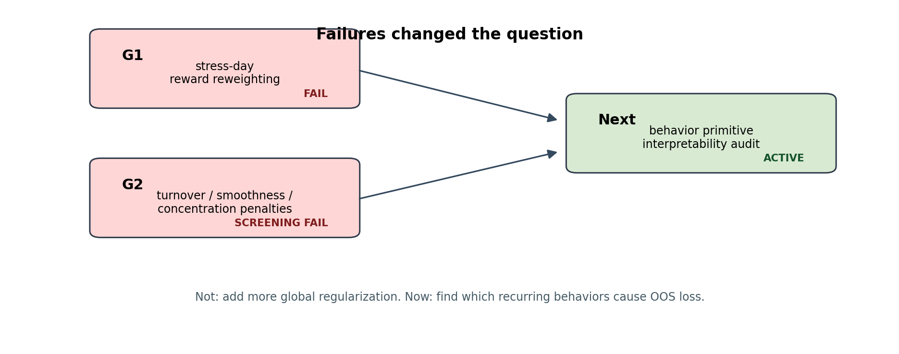

# RL for Financial Time-Series Forecasting

Goal: build a Dow 30 PPO trading agent that remains reliable when market regimes change.

The current result is conservative: `base_macro` is still the best reference policy, generic feature expansion did not beat it, G1/G2 robustness interventions failed, and the active next step is behavior-level interpretability.

This is the project path: baseline PPO, feature ablation, robustness failures, then behavior primitives.

## Experiments As Questions

| Question | Experiment | Answer |
|---|---|---|
| Which PPO setup is worth studying? | Baseline PPO comparison | Custom reward + custom MLP became the working reference, but passive baselines stayed hard to beat. |
| Do more feature families improve OOS reliability? | Feature ablation | No. `base_macro` remained the strongest reference after Horizon A. |
| Does PPO just underweight stress days? | G1 stress reweighting | No reliable OOS improvement. |
| Does PPO just trade too aggressively? | G2 action penalties | No. Lower turnover alone did not improve benchmark-relative quality. |
| What now? | Behavior primitives | Find recurring behaviors that explain success and failure before another PPO intervention. |

## Current Evidence

The best feature candidates were useful diagnostics, but none replaced `base_macro`.

| Stage | Best/Key result | Decision |
|---|---|---|
| Baseline PPO | RL configuration stabilized | Keep as research baseline |
| Feature ablation | `base_macro` median test Sharpe `1.3378` | Keep as reference |
| G1 domain robustness | stress reward weighting mixed/noisy | Fail |
| G2 conservative actions | one-seed screen found no pass | Screening fail |
| Behavior primitives | 6 primitives, several failure candidates | Active diagnostic stage |

The failed robustness branches changed the question from global regularization to targeted failure-mode discovery.

## Repository Map

| Path | What to read |
|---|---|
| `experiments/baseline-ppo/` | First PPO setup comparison. |
| `experiments/feature-ablation/` | Horizon A feature-family search and final ranking. |
| `experiments/domain-robustness/` | G1/G2 robustness tests: both failed. |
| `experiments/action-audit/` | Latent-action offline diagnostics. |
| `experiments/behavior-primitives/` | Current interpretability-first audit. |
| `src/` | Reproducible research utilities. |
| `configs/` | Launch configs grouped by experiment stage. |

## Bottom Line

This repo does not claim a finished trading edge. It documents a disciplined path toward one: keep the strongest baseline, reject weak improvements, diagnose failure behavior, and only then design the next PPO experiment.
