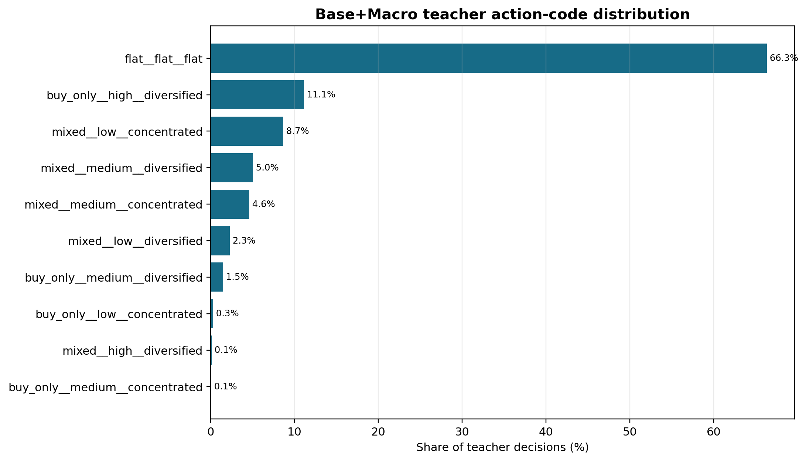
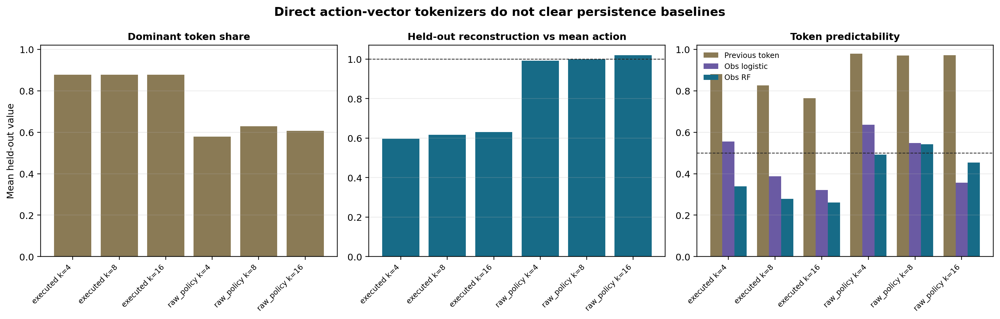

# Action Audit

Question: do teacher actions contain reusable latent primitives that can drive the next PPO method?

| Question | Answer |
|---|---|
| What was audited? | Frozen `base_macro` teacher actions and simple action-code variants. |
| Main finding | Action codes are persistence-dominated. |
| Did VQ/KMeans-style tokenization pass? | No. It mostly rediscovered hold-like behavior. |
| Current use | Diagnostic side branch, not the main training intervention. |

The teacher policy has strong persistence, so naive action tokens are weak training targets.

Better action reconstruction did not imply a better trading hypothesis.

| File | Purpose |
|---|---|
| `outputs/teacher_action_summary.csv` | Direct teacher action diagnostics. |
| `outputs/state_action_predictability_summary.csv` | Whether state/action history predicts codes. |
| `outputs/action_tokenizer_diagnostic_summary.csv` | Tokenizer diagnostic summary. |
