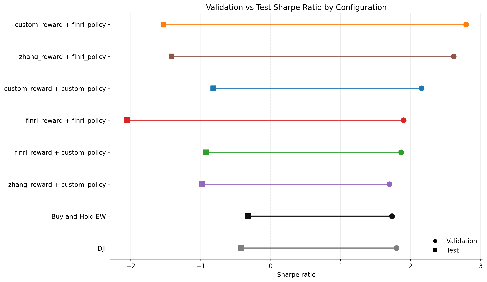
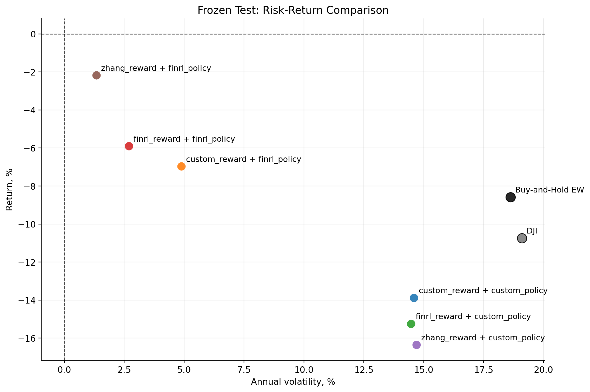

# Baseline PPO

Question: which PPO setup is stable enough to use as the research baseline?

| Question | Answer |
|---|---|
| What was tested? | Reward function, policy network, early stopping, dropout, and seed stability. |
| What worked best? | Custom reward + custom MLP became the working PPO reference. |
| Did it solve trading? | No. Frozen-test passive baselines remained difficult to beat. |
| Why keep it? | It gives a controlled reference for later feature and robustness tests. |

Validation strength did not reliably translate into frozen-test strength.

The useful outcome was not a deployable strategy; it was a stable experiment baseline.

| File | Purpose |
|---|---|
| `outputs/config_summary.csv` | Compact PPO configuration summary. |
| `outputs/benchmark_summary.csv` | Benchmark-aware results. |
