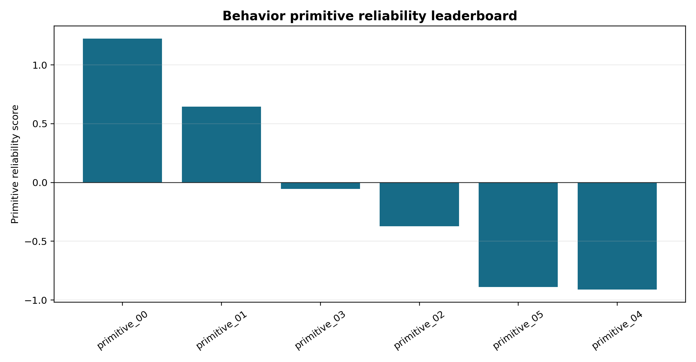
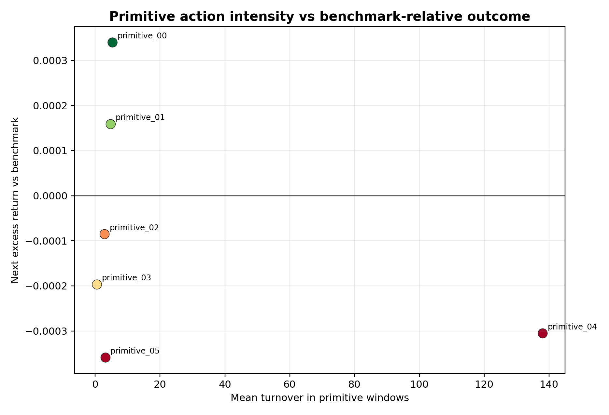
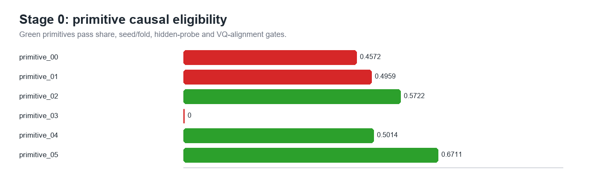
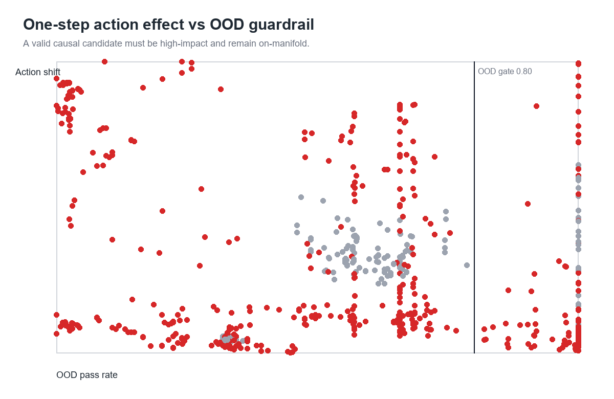
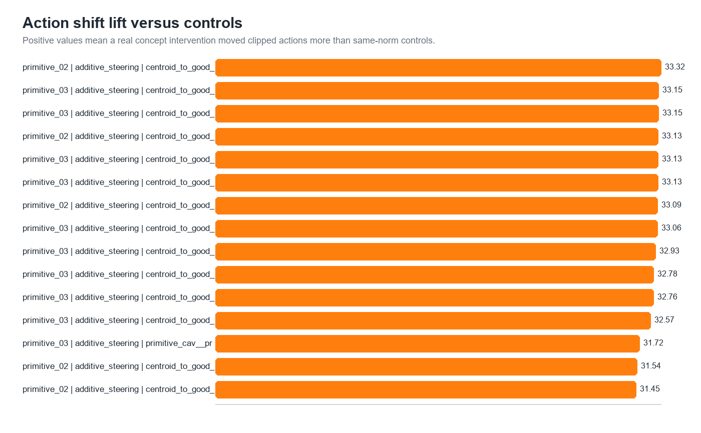

# Behavior Primitives

Question: which recurring PPO behaviors explain out-of-sample success and failure?

| Question | Answer |
|---|---|
| Why this stage? | G1/G2 failed, so the next step is failure-mode discovery. |
| What is a primitive? | A rolling state-action-return behavior window, not a one-day action code. |
| How many found? | 6 behavior primitives. |
| Main use | Generate targeted hypotheses before another PPO experiment. |
| Did causal intervention pass? | No. Hidden-state interventions did not produce an OOD-safe, control-beating rollout candidate. |

The audit separates reliable-looking behavior from negative excess-return primitives.

Some bad primitives are not just high-turnover; the failure is conditional and behavior-specific.

| Primitive | Share | Excess Sharpe | Initial read |
|---|---:|---:|---|
| `primitive_00` | 0.161 | 1.422 | profitable candidate |
| `primitive_02` | 0.416 | -0.471 | broad failure candidate |
| `primitive_04` | 0.066 | -1.644 | high-action-change failure |
| `primitive_05` | 0.092 | -1.258 | drawdown-stress failure |

## Controlled Causal Audit

The final interpretability test asked a stricter question: can a bad primitive be causally edited inside the frozen PPO policy and fixed historical simulator?

| Gate | Result | Meaning |
|---|---:|---|
| Eligible bad primitives | 3 | `primitive_02`, `primitive_04`, `primitive_05` were coherent enough to test. |
| Gradient/action rows | 546 / 295,261 | Directions and one-step interventions were evaluated. |
| Rollout candidates | 0 | No intervention passed the safety and control gates. |
| Final label | `failed_or_artifact` | Do not build a targeted PPO intervention from this result. |

Bad primitives were eligible for testing, but eligibility is not enough for a causal claim.

Interventions moved actions, but the useful-looking effects did not survive OOD/control filtering.

The controlled audit blocks a false positive: primitive editing is descriptive evidence, not a deployable robustness method yet.

## Decision

This stage is useful as a negative result. It says the current PPO teacher can be described with behavior primitives, but those primitives are not reliable control levers for improving OOS performance. The next research move should focus on model stability and structure, not another global SSL regularizer.
