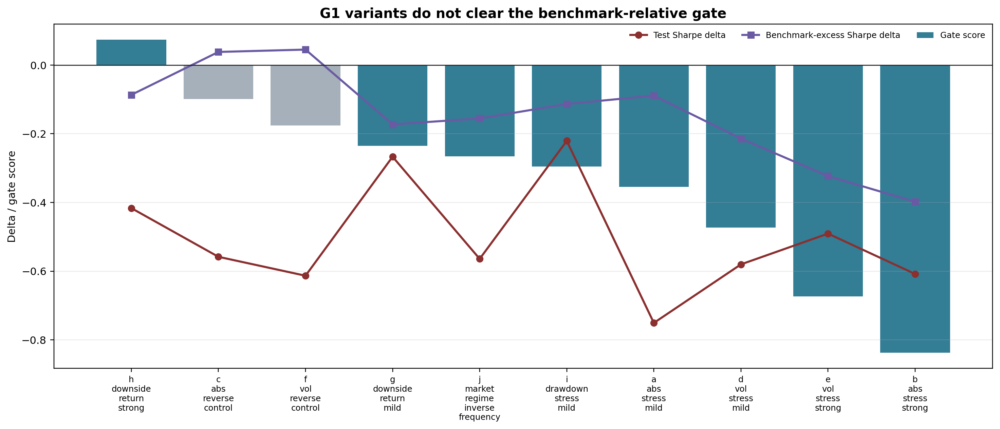
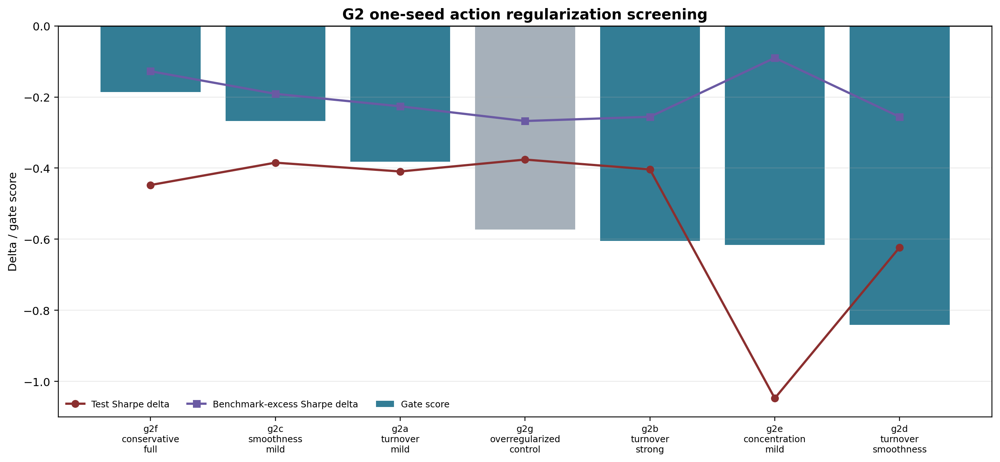

# Domain Robustness

Question: can simple training-time robustness interventions make PPO more reliable?

| Question | Experiment | Answer |
|---|---|---|
| Does PPO underweight stress days? | G1 stress reward reweighting | No reliable OOS pass. |
| Does PPO trade too violently? | G2 action penalties | No one-seed screening pass. |
| Should G3 combine them? | G1 + G2 | No. Both mechanisms were too weak. |

Stress weighting changed behavior, but did not produce reliable benchmark-relative improvement.

Action penalties reduced some behavior metrics, but did not improve the full reliability gate.

| Branch | Mechanism | Decision |
|---|---|---|
| G1 | stress/domain reward reweighting | Fail |
| G2 | turnover, smoothness, concentration penalties | Screening fail |
| Next | behavior primitive audit | Active |
