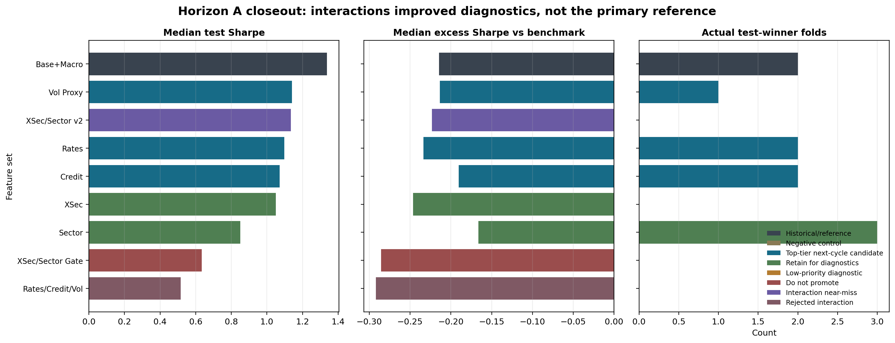
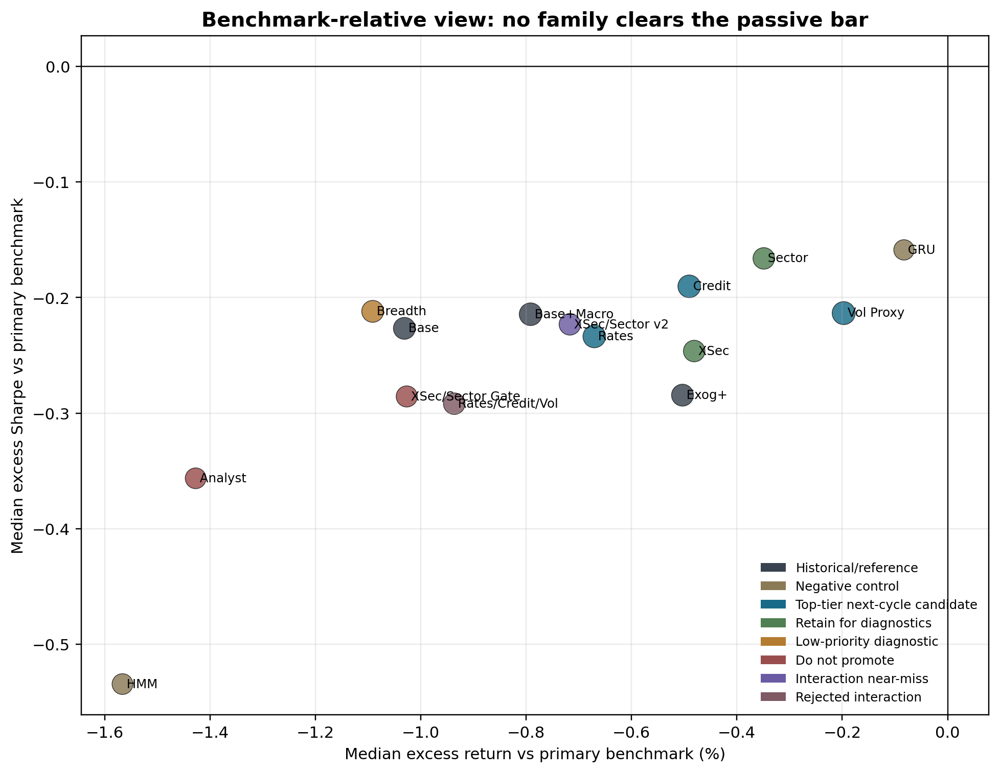

# Feature Ablation

Question: can feature families beat the `base_macro` PPO reference out of sample?

| Question | Answer |
|---|---|
| What was tested? | Macro, HMM/GRU, volatility, rates, credit, analyst/revision, cross-sectional, sector, and interaction families. |
| Best reference? | `base_macro`. |
| Did any candidate replace it? | No. Several were diagnostic, none passed promotion guardrails. |
| Why close Horizon A? | Selection reliability worsened as the feature panel expanded. |

`base_macro` remains the reference; the interaction branches did not become robust winners.

Benchmark-relative metrics prevented overclaiming from raw Sharpe alone.

| Feature set | Median test Sharpe | Decision |
|---|---:|---|
| `base_macro` | 1.3378 | Primary reference |
| `base_macro_vol_term_or_implied_vol_proxy` | 1.1405 | Diagnostic only |
| `base_macro_xsec_sector_complementarity_v2` | 1.1347 | Near miss |
| `base_macro_rates_credit_vol_risk_state_context` | 0.5151 | Reject |
